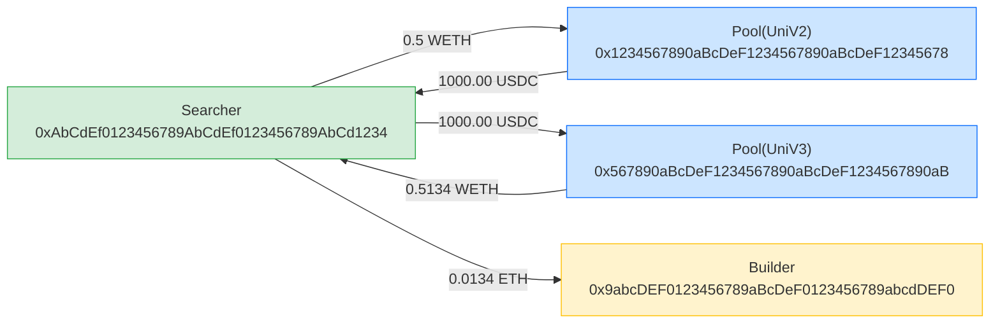

# mev-detail-report

Fetch a single MEV event by ID (tx hash) and produce a structured analysis report in English.

## Trigger

Use when the user asks to: analyze a MEV event, show MEV detail, explain a MEV tx, or provides a tx hash and asks for a report.

## Instructions

### 1. Parse parameters

- `mev_id`: the MEV event ID (transaction hash). Extract from user input.

### 2. Fetch MEV detail

Call `mcp__mevscan__get_mev_detail` with the `mev_id`.

If the result has `ok: false` or `error`, report the error and stop.

### 3. Build the report

Output the report in **markdown format**. The report has four sections in this order: **Conclusion**, **Facts** (Summary + Token Flow Chart), and **EigenTx** (Mermaid).

#### 3.1 Conclusion

Write a concise analytical conclusion (2-4 sentences) covering:
- What type of MEV this is and a one-line summary of what happened
- Key characteristics of this transaction (e.g., profit-to-cost ratio, use of flash loans, number of hops, protocols involved)
- Any notable observations (e.g., unusually high profit, failed arb with negative profit, cross-protocol arbitrage, single-hop vs multi-hop)

This section should be written in plain English as analysis, not as a table. Base all conclusions strictly on the data in the Facts and Token Flow Chart sections below — do not speculate beyond what the data shows.

#### 3.2 Facts

##### 3.2.1 Summary

Extract from the response `data`:

| Field | Source |
|-------|--------|
| MEV Type | `data.type` (uppercase) |
| Block Number | `data.block_number` |
| Block Timestamp | `data.block_timestamp` (convert to UTC datetime) |
| Tx Hash | `data.id` |
| Tx Index | `data.mev_tx_relation.primary[0].txIndex` |
| From | `data.mev_tx_relation.primary[0].from` |
| To | `data.mev_tx_relation.primary[0].to` |
| Revenue | `data.pnl.summary.revenueUsd` (format as USD) |
| Cost | `data.pnl.summary.costUsd` (format as USD) |
| Profit | `data.pnl.summary.profitUsd` (format as USD) |

##### 3.2.2 Token Flow Chart

Compute per-address balance changes from `data.mev_tx_relation.primary[0].transfers`:

1. For each transfer, group by `(address, tokenId)`:
   - `from` address: subtract `amount`
   - `to` address: add `amount`
2. Merge all transfers to get net balance change per address per token.
3. Convert amounts using token decimals (ETH/WETH: 18 decimals, USDC/USDT: 6 decimals, default: 18 decimals).

Tag each address with roles:
- **Searcher**: if address is in `data.mev_tx_relation.primary[0].summary.searchers[]`
- **Miner/Builder**: if address is the `to` of a transfer from searcher and is the last transfer (typically builder tip)
- **Pool**: if address appears as `poolId` (or first part of `poolId` before `|`) in any action. Include protocol name, e.g. `Pool(UniV3)`

Display as a **pivot table** where columns are tokens and rows are addresses (with tag):

```
| Address | ETH | WETH | TOKEN |
|---------|------|------|-------|
| 0xabcd...1234 (Searcher) | +0.5134 | -0.5000 | |
| 0x1234...5678 (Pool UniV2) | -0.5000 | +0.5000 | -1000.00 |
| 0x5678...abcd (Builder) | +0.0134 | | |
```

- Row header format: `full_address (Tag)`
- Empty cells where an address has no balance change for that token
- Order rows: Searcher(s) first, then Pools, then others (Builder/Miner last)
- Order columns by token importance: ETH, WETH, USDC, USDT, then others

##### 3.2.3 EigenTx

Generate a Mermaid `graph LR` diagram from `data.mev_tx_relation.primary[0].transfers` to visualize the token flow.

**Construction rules:**

1. **Nodes**: Each unique address becomes a node. Use the address's role tag as the node label:
   - Searcher addresses: `Searcher<br/>0xFullAddress`
   - Pool addresses: `Pool(ProtocolName)<br/>0xFullAddress`
   - Builder/Miner addresses: `Builder<br/>0xFullAddress`
   - Other addresses: `0xFullAddress`

2. **Edges**: For each transfer in the transfers array, draw a directed edge from `from` → `to`:
   - Edge label: `amount tokenSymbol` (human-readable, converted with decimals)
   - Combine transfers with the same `from`, `to`, and `tokenId` by summing amounts before drawing

3. **Deduplication**: Deduplicate edges that have the same from, to, and token. Sum the amounts.

4. **Styling** (optional Mermaid classDef):
   - Searcher nodes: green fill
   - Pool nodes: blue fill
   - Builder nodes: orange fill

**Example output:**

````markdown

````

### 4. Protocol ID mapping

Use these mappings for `protocolId` → display name:

| ID | Name |
|----|------|
| 0 | ERC20 |
| 2 | UniV2 |
| 3 | UniV3 |
| 4 | UniV4 |
| 5 | SushiV2 |
| 6 | SushiV3 |
| 10 | CurveMain |
| 11 | CurveCrypto |
| 19 | Curve |
| 20 | DODOV1 |
| 21 | DODOV2 |
| 30 | BalancerV2 |
| 31 | Balancer |
| 40 | KyberSwap |
| 43 | KyberDMM |
| 50 | Bancor |
| 51 | BancorV3 |
| 60 | PancakeV3 |
| 90 | CowProtocol |
| 520 | UniswapX |

For unknown IDs, display `Protocol({id})`.

### 5. Token symbol mapping

| Address | Symbol | Decimals |
|---------|--------|----------|
| 0xeeee...eeee | ETH | 18 |
| 0xc02a...6cc2 | WETH | 18 |
| 0xa0b8...eb48 | USDC | 6 |
| 0xdac1...31ec7 | USDT | 6 |
| 0x6b17...d0f | DAI | 18 |
| 0x2260...c599 | WBTC | 8 |

For unknown tokens, display the full token address and assume 18 decimals.

### 6. Output format

```markdown
## MEV Analysis Report

### Conclusion

This is a 2-hop cross-protocol arbitrage exploiting a price discrepancy between UniV4 and UniV2 pools. The searcher profited $0.78 with a profit-to-cost ratio of 0.42x, using a relatively small position size. The arbitrage route converted ETH through an intermediate token before returning to WETH.

### Facts

#### Summary

| Field | Value |
|-------|-------|
| Type | ARBITRAGE |
| Block | 24970295 |
| Timestamp | 2026-04-27 08:51:23 UTC |
| Tx Hash | 0x23d6a1b2c3d4e5f6a7b8c9d0e1f2a3b4c5d6e7f8a9b0c1d2e3f4a5b6c7d8de56 |
| Tx Index | 4 |
| From | 0x3c1bA2C3D4E5F6a7B8c9D0e1F2A3b4C5D6e7c380 |
| To | 0x0489B2C3D4E5F6a7B8c9D0e1F2A3b4C5D6e72123 |
| Revenue | $2.63 |
| Cost | $1.85 |
| **Profit** | **$0.78** |

#### Token Flow Chart

| Address | ETH | WETH | 0x15ffA1B2C3D4E5F6a7B8c9D0e1F2A3b4C5D6e78f |
|---------|------|------|------------|
| 0x0489B2C3D4E5F6a7B8c9D0e1F2A3b4C5D6e72123 (Searcher) | +0.000513 | -0.009722 | |
| 0x0000A1B2C3D4E5F6a7B8c9D0e1F2A3b4C5D68A90 (Pool UniV4) | -0.010856 | | |
| 0x03AeB2C3D4E5F6a7B8c9D0e1F2A3b4C5D6e71093 (Pool UniV2) | | +0.009722 | -764.75 |
```

### 7. Save to file

After displaying the report, automatically write the full markdown content to a file:
- File path: `./mev-reports/{tx_hash}.md` (relative to the current working directory)
- Create the `mev-reports` directory if it doesn't exist
- Use the full tx hash as the filename (e.g., `0x97f15c243103b96f4b978ec8199b3a512d510c757d0058d1b9728f854367b490.md`)
- Inform the user of the saved file path after writing

### 8. Edge cases

- If `mev_tx_relation` has `frontrun`/`backrun`/`victim` keys (sandwich type), process each sub-relation separately and label them in the report.
- If no transfers found, note "No transfers recorded for this event."
- Addresses and tx hashes must be displayed in FULL — never abbreviate.
